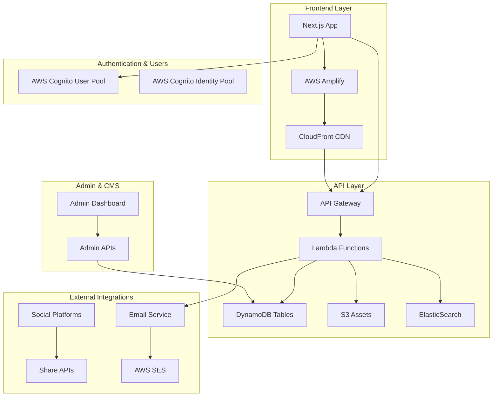

# UK Young Adult Side Hustle Directory – MVP PRD

## Status: Updated Draft v2.0

---

## Executive Summary

Young adults (16‑30) in the UK struggle to find trustworthy, comprehensive, and well‑organised information on side‑hustle opportunities in a fragmented digital landscape. This MVP delivers the UK's **most comprehensive, reliable, and user-friendly** side hustle directory, specifically designed for young adults. 

Building on extensive market research and competitive analysis, this platform will establish the UK's leading resource through a mobile‑first, SEO‑optimised web directory that aggregates 50‑80 curated listings initially, enabling intuitive discovery through user-centric categories and powerful filtering, with user accounts for personalisation and community features—establishing the foundation for a long‑term, community‑driven platform.

---

## Market Opportunity & Competitive Positioning

### The Opportunity
The UK side hustle market for young adults represents a significant gap in the digital landscape. Existing resources are fragmented across generic business directories (Yell.com), gig platforms (Upwork, TaskRabbit), and scattered blog posts. No dedicated, comprehensive, reliable directory exists specifically for UK young adults seeking side income opportunities.

### Unique Value Proposition (UVP)
**"The UK's most comprehensive, reliable, and user-friendly directory of side hustles, specifically curated and designed for young adults."**

**Key Differentiators:**
- **UK-Focused**: Tailored to UK opportunities, platforms, and regulations
- **Young Adult Centric**: Design, language, and content selected for 16-30 demographic
- **Comprehensiveness**: Widest range of legitimate side hustles (online, offline, skill-based, asset-based)
- **Reliability**: Commitment to accuracy, verification, and trustworthy information
- **Superior UX**: Mobile-first, intuitive navigation, powerful search/filtering
- **Community-Driven**: Peer support, reviews, success stories, and advice

### Competitive Landscape
- **Direct Competitors**: None identified - significant market gap
- **Indirect Competitors**: Generic gig platforms (Fiverr, Upwork), business directories (Yell), side hustle blogs
- **Competitive Advantage**: Niche focus + comprehensive coverage + superior UX + community features

---

## Goals and Context

| Objective                        | Measure of Success / KPI                                |
| -------------------------------- | ------------------------------------------------------- |
| Establish market leadership      | Become top 3 Google result for "UK side hustles" within 6 months |
| Drive early traffic and virality | 15%+ of total sessions triggered via share links        |
| Achieve engagement               | ≥1,000 Monthly Active Users within 3 months of launch   |
| Build user trust / retention     | 25% of registered users save ≥3 listings within 30 days |
| Community adoption               | 10% of users engage with community features monthly      |

**Success Criteria:**
• Users discover side hustles quickly using intuitive categories and filters
• JSON‑LD structured data yields indexation of _all_ public pages by Google within 30 days
• System uptime ≥99.9% on AWS infrastructure
• Mobile-first experience with ≤1.8s LCP on 4G connections
• Clear differentiation from generic gig platforms and directories

---

## Target Audience

**Primary:** UK residents aged 16-30 including:
- Students (secondary, college, university)
- Recent graduates
- Early career professionals
- Those seeking supplementary income

**User Characteristics:**
- Digitally native, expect modern web/mobile interfaces
- Motivated by financial independence, skill development, passion projects
- Value convenience, reliability, peer validation
- Varying skill levels, experience, and time availability
- Comfortable with social interaction and community features

**User Personas:**
1. **"The Student"** - University student seeking flexible income around studies
2. **"The Graduate"** - Recent graduate exploring options while job hunting
3. **"The Entrepreneur"** - Young professional testing business ideas
4. **"The Skill Builder"** - Individual looking to monetise existing skills/hobbies

---

## Product Strategy & Categorisation Framework

### User-Centric Category Structure

Based on extensive research into user mental models and successful directory patterns, the platform uses **action-oriented categories** with **comprehensive filtering** for precise discovery:

#### Primary Categories:

1. **Create & Sell** 🎨
   - Make or source products (digital or physical) and sell them.
   - Examples: Handmade goods, print-on-demand, digital downloads, flipping/reselling, stock photos.
   
2. **Offer Your Skills** 💼  
   - Freelance or gig work that trades time for money.
   - Examples: Writing, design, coding, tutoring, social media management, admin support.
   
3. **Rent or Share Your Stuff** 🏠
   - Monetize physical assets you already own.
   - Examples: Rent a spare room, car, tools, camera gear, storage space.
   
4. **Help Out Locally** 📍
   - In-person, flexible, often casual labour.
   - Examples: Babysitting, dog walking, gardening, delivery, event staffing.
   
5. **Do Quick Jobs Online** 💻
   - Tasks that can be done remotely with low or no barrier to entry.
   - Examples: Surveys, product/user testing, AI training, microtasks, affiliate marketing.

6. **Be a Creator** 🎬
   - Content-first opportunities that build an audience and monetize over time.
   - Examples: YouTube, TikTok, blogging, newsletters, podcasting, streaming.

7. **Play with Tech & Trends** 🚀
   - Emerging or niche ways to earn using modern platforms.
   - Examples: Selling in-game items, matched betting, cashback apps, crypto/NFTs, bug bounties.

#### Cross-Category Filter System:

**Essential Filters:**
- **Location**: Online/Remote, Local (with region), UK-Wide
- **Platform Specific**: Etsy, Fiverr, YouTube, TikTok, Deliveroo, Airbnb, etc.
- **Skills Required**: Writing, Design, Coding, Driving, Customer Service, None, etc.
- **Income Potential**: £ (Variable/Low), ££ (Moderate), £££ (High)
- **Time Commitment**: Flexible, Fixed, Evenings/Weekends, <5hrs, 5-15hrs, >15hrs
- **Startup Cost**: None, Low (<£50), Medium (£50-£250), High (>£250)
- **Interests**: Animals, Creative, Tech, Food, Fashion, Gaming, Helping People, etc.

---

## Features and Requirements

### Functional Requirements

#### Core Directory Features
1. **Enhanced Directory Listings**  
   - User-centric category browsing with visual grid
   - Advanced full-text search with autocomplete
   - Multi-faceted filter panel with real-time results
   - Sort options (relevance, income potential, time commitment, newest)

2. **Rich Listing Detail Pages**  
   - Comprehensive opportunity descriptions
   - Estimated earnings with variability disclaimers
   - Required skills, qualifications, equipment
   - Time commitment and flexibility details
   - Startup costs and ongoing expenses
   - Pros/cons analysis
   - "Verified" trust badges
   - Platform links with UTM tracking
   - Related opportunities recommendations

3. **User Account System**  
   - Email + password registration via AWS Cognito
   - User profiles with preferences (skills, interests, location)
   - Password reset and email verification flows
   - Optional profile enhancements for community participation

4. **Personalisation Features**  
   - Save/unsave favourite listings
   - "Saved Hustles" dashboard with organisation
   - Personalised recommendations based on profile
   - Custom search alerts and notifications

5. **Social Sharing & Viral Growth**  
   - Native mobile sharing (`navigator.share`)
   - Social platform integrations (WhatsApp, Instagram, TikTok)
   - UTM-tracked share links for analytics
   - "Share to earn" potential for future gamification

#### Community Features (Phase 2)
6. **User Reviews & Ratings**  
   - 5-star rating system for opportunities
   - Detailed written reviews with moderation
   - Helpful/unhelpful voting on reviews
   - Verified reviewer badges

7. **Community Engagement**  
   - Q&A sections on listing pages
   - User success story submissions
   - Basic discussion forums by category
   - Peer-to-peer advice and tips

#### Administrative Features
8. **Content Management System**  
   - Protected admin dashboard
   - CSV/JSON bulk import for listings
   - Manual listing creation and editing
   - User content moderation tools
   - Analytics and reporting dashboard

9. **Legal & Compliance**  
   - Terms of Service and Privacy Policy
   - Cookie consent management
   - GDPR compliance features
   - Content moderation guidelines

### Non‑Functional Requirements

#### Performance & SEO
- **Performance**: LCP ≤1.8s, TTI ≤3s on 4G connections
- **SEO**: Server-side rendering with Next.js
- **Structured Data**: JSON-LD schemas (BreadcrumbList, ItemList, JobPosting)
- **Mobile Optimisation**: Mobile-first responsive design
- **Accessibility**: WCAG 2.1 AA compliance

#### Security & Reliability
- **Security**: OWASP Top-10 mitigations, AWS security best practices
- **Uptime**: ≥99.9% availability SLA
- **Data Protection**: GDPR compliance, secure data handling
- **Scalability**: Auto-scaling AWS infrastructure from day one

#### User Experience Standards
- **Design System**: Consistent UI components via shadcn/ui
- **Mobile-First**: Touch-friendly interactions, thumb-accessible navigation
- **Visual Appeal**: Modern, clean design appealing to young adults
- **Loading States**: Skeleton screens, progressive loading
- **Error Handling**: User-friendly error messages and fallbacks

---

## Data Architecture & Models

### Enhanced DynamoDB Schema

#### Categories Table
```typescript
{
  PK: "CATEGORY#{slug}",           // e.g., "CATEGORY#create-and-sell"
  SK: "METADATA",
  slug: string,                    // kebab-case identifier
  name: string,                    // "Create & Sell"
  description: string,             // category description
  icon: string,                    // icon identifier
  sortOrder: number,               // display order
  filterDefinitions: {             // available filters for this category
    skillsRequired: {
      name: "Skills Required",
      type: "multiselect",
      options: ["None", "Design", "Writing", "Photography"]
    },
    // ... other filters
  },
  metaData: {
    seoTitle: string,
    seoDescription: string,
    totalListings: number
  },
  createdAt: string,
  GSI1PK: "CATEGORY",
  GSI1SK: number                   // sortOrder for ordered queries
}
```

#### Enhanced Listings Table
```typescript
{
  PK: "LISTING#{slug}",
  SK: "METADATA",
  slug: string,
  title: string,
  description: string,
  category: string,                // category slug
  verified: boolean,
  verificationLevel: "manual" | "platform" | "user-submitted",
  
  // Enhanced metadata
  earnings: {
    min: number,                   // minimum potential (£/month)
    max: number,                   // maximum potential (£/month)
    type: "hourly" | "monthly" | "per-task" | "variable",
    disclaimer: string
  },
  
  requirements: {
    skills: string[],              // required skills
    equipment: string[],           // required equipment
    qualifications: string[],      // required qualifications
    startupCost: number,          // initial investment
    timeCommitment: {
      min: number,                 // hours per week
      max: number,
      flexibility: "high" | "medium" | "low"
    }
  },
  
  // Filter values
  filterValues: {
    location: "online" | "local" | "uk-wide",
    platform: string[],           // associated platforms
    skillsRequired: string[],
    incomePotential: "low" | "medium" | "high",
    startupCost: "none" | "low" | "medium" | "high",
    interests: string[]
  },
  
  // External links
  externalUrls: {
    primary: string,              // main platform link
    additional: string[],         // other relevant links
    tutorial: string              // getting started guide
  },
  
  // SEO and content
  metaData: {
    seoTitle: string,
    seoDescription: string,
    prosCons: {
      pros: string[],
      cons: string[]
    }
  },
  
  // Analytics
  analytics: {
    views: number,
    saves: number,
    shares: number,
    clicks: number
  },
  
  createdAt: string,
  updatedAt: string,
  GSI1PK: "LISTING#{category}",
  GSI1SK: string,                  // createdAt for sorting
  GSI2PK: "LISTING_VERIFIED",      // for verified listings
  GSI2SK: string                   // updatedAt for freshness
}
```

#### User Profiles & Preferences
```typescript
{
  PK: "USER#{cognitoUserId}",
  SK: "PROFILE",
  userId: string,
  email: string,
  preferences: {
    skills: string[],
    interests: string[],
    location: string,
    timeAvailability: "low" | "medium" | "high",
    preferredIncome: "low" | "medium" | "high"
  },
  onboardingComplete: boolean,
  createdAt: string,
  lastLoginAt: string
}
```

---

## Implementation Strategy

### Phase 1: MVP Core (Weeks 1-8)
**Epic 0: Foundation Setup**
- Monorepo setup with Next.js 14, TypeScript, Tailwind CSS
- AWS infrastructure (CDK/Terraform) for DynamoDB, Cognito, S3
- CI/CD pipeline with GitHub Actions
- Design system implementation with shadcn/ui

**Epic 1: Content & Data Architecture**
- Enhanced DynamoDB schema implementation
- Admin dashboard for content management
- Initial data seeding (50-80 verified listings)
- Content verification and quality processes

**Epic 2: Core Directory Experience**
- Landing page with category grid
- Advanced search and filtering system
- Listing detail pages with rich content
- Mobile-first responsive design
- SEO optimisation and JSON-LD implementation

**Epic 3: User Accounts & Personalisation**
- AWS Cognito authentication integration
- User registration and profile management
- Favourites and saved listings functionality
- Basic personalisation features

**Epic 4: Sharing & Growth**
- Social sharing implementation
- UTM tracking and analytics
- Performance optimisation
- SEO testing and validation

### Phase 2: Community & Engagement (Weeks 9-16)
**Epic 5: User-Generated Content**
- Review and rating system
- User comment moderation
- Q&A functionality on listings
- Community guidelines implementation

**Epic 6: Enhanced Discovery**
- Advanced recommendation engine
- Trending and popular listings
- Personalised user dashboards
- Search analytics and improvements

### Phase 3: Growth & Monetisation (Weeks 17-24)
**Epic 7: Monetisation Features**
- Affiliate link integration
- Featured listing capabilities
- Analytics dashboard for revenue tracking
- Performance monitoring and optimisation

**Epic 8: Community Features**
- User success story submissions
- Basic forum functionality
- User profile enhancements
- Gamification elements

---

## Technology Stack & Architecture

### Core Technology Stack
| Layer            | Technology                              | Version / Notes                                 |
| ---------------- | --------------------------------------- | ----------------------------------------------- |
| Frontend         | Next.js                                 | 14.x with App Router                            |
| UI Framework     | React 18 + shadcn/ui                   | Tailwind CSS v3                                |
| Language         | TypeScript                              | 5.x with strict mode                            |
| Database         | AWS DynamoDB                            | Single-table design with GSIs                   |
| Authentication   | AWS Cognito                             | User Pools + Identity Pools                     |
| File Storage     | AWS S3                                  | Image assets and file uploads                    |
| API Layer        | AWS API Gateway + Lambda                | Serverless backend architecture                  |
| Hosting          | AWS Amplify / CloudFront                | Global CDN with edge caching                     |
| Email Service    | AWS SES                                 | Transactional emails and notifications          |
| Analytics        | AWS CloudWatch + Custom                 | Performance and user analytics                   |
| Search           | DynamoDB + ElasticSearch                | Full-text search capabilities                    |

### High-Level Architecture


---

## Monetisation Strategy

### Phase 1: Trust Building (Months 1-6)
- **Focus**: User acquisition and trust establishment
- **Revenue**: None - invest in user experience
- **Strategy**: Build authority and user base

### Phase 2: Non-Intrusive Monetisation (Months 7-12)
- **Affiliate Marketing**: Natural integration within listings
- **Featured Listings**: Limited, clearly marked premium placements
- **Revenue Target**: £500-2,000/month

### Phase 3: Advanced Monetisation (Year 2+)
- **Premium Subscriptions**: Advanced features, analytics, early access
- **Community Features**: Premium user features and enhanced support
- **Partnerships**: Revenue sharing with platforms and service providers
- **Revenue Target**: £5,000-15,000/month

---

## Risk Management & Mitigation

| Risk Category        | Risk Description                          | Likelihood | Impact | Mitigation Strategy                                    |
| -------------------- | ----------------------------------------- | ---------- | ------ | ------------------------------------------------------ |
| **Market**           | Competition from established platforms    | Medium     | High   | Focus on niche positioning and superior UX            |
| **Technical**        | AWS service costs scaling unexpectedly   | Medium     | Medium | Implement cost monitoring and efficient query patterns |
| **Content**          | Difficulty sourcing quality listings     | Low        | High   | Build relationships with platforms and manual curation |
| **User Adoption**    | Low initial user engagement              | Medium     | High   | Invest heavily in UX, content quality, and SEO        |
| **Legal**            | GDPR compliance and data protection      | Low        | High   | Implement privacy-by-design and regular audits        |
| **Operational**      | Content moderation at scale              | Medium     | Medium | Automated tools + human moderation hybrid approach     |

---

## Success Metrics & KPIs

### Launch Phase (Months 1-3)
- **Traffic**: 1,000+ monthly active users
- **Engagement**: 25% user registration rate
- **Content**: 50-80 verified listings across all categories
- **SEO**: Top 10 ranking for "UK side hustles"
- **Performance**: <2s page load times

### Growth Phase (Months 4-12)
- **Traffic**: 10,000+ monthly active users
- **Community**: 500+ user-generated reviews
- **Retention**: 40% monthly active user return rate
- **Revenue**: £1,000+ monthly recurring revenue
- **Brand**: 5,000+ social media followers

### Scale Phase (Year 2+)
- **Market Position**: #1 UK side hustle resource
- **User Base**: 50,000+ registered users
- **Content**: 500+ verified opportunities
- **Revenue**: £10,000+ monthly recurring revenue
- **Community**: Active forums with daily engagement

---

## Post-MVP Roadmap

### Year 1 Enhancements
- Advanced personalisation engine using ML
- Mobile app (PWA initially, then native)
- Video content and tutorials
- Local meetups and events integration

### Year 2+ Vision
- Pan-European expansion
- B2B platform for employers
- Creator economy tools and resources
- Advanced analytics and insights platform

---

## Change Log

| Version | Date | Changes | Author |
| ------- | ---- | ------- | ------ |
| v1.0    | Initial | First draft with basic AWS architecture | Team |
| v2.0    | Updated | Comprehensive update incorporating market research findings, enhanced UX strategy, improved category structure, community features, and strategic positioning | Team |

---

## Conclusion

This updated PRD incorporates extensive market research and competitive analysis to position the UK Side Hustle Directory as the definitive resource for young adults seeking side income opportunities. The user-centric approach, combined with robust technical architecture and clear monetisation strategy, provides a solid foundation for building the UK's leading side hustle platform.

The phased implementation approach balances the need for a strong MVP launch with the long-term vision of a comprehensive, community-driven platform that serves as the trusted authority in the UK side hustle ecosystem.
